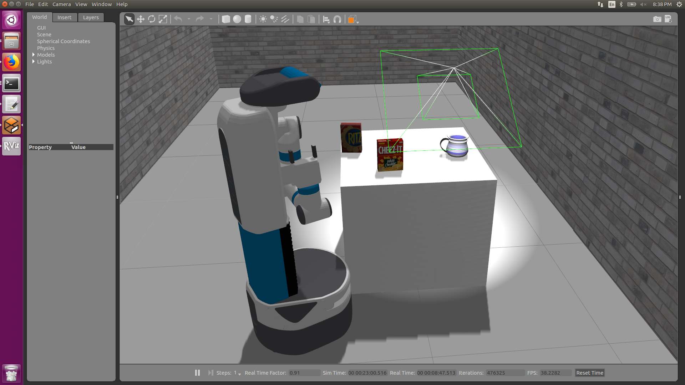

This project provides a feasible solution for humanoid indoor service robot to navigation, recognition and grasping. Fetch robot has been selected as a platform to realize the goal. After building the environment and adding relevant models into the environment, the robot is expected to self explore the world map and perform real time navigation. When the robot reaches to the goal destination, vision will be performed for object recognition and pose estimation.Motion planning will be evaluated for grasping tasks which will be studied in the future. We describe the implementation details and give the results of our experiments for all stages in this section.  

Exploration - Youtube: https://youtu.be/2f2zy2ZkvsE  
Navigation - Youtube: https://youtu.be/qpAtfTZZJHI  
  
Vision Recognition  

  
Vision Motion Plan  

